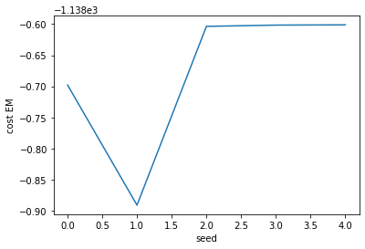
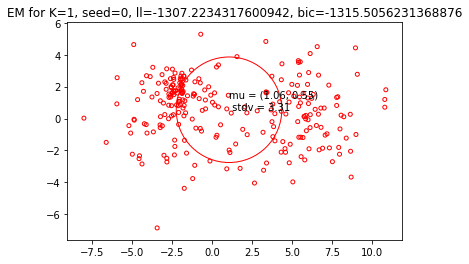
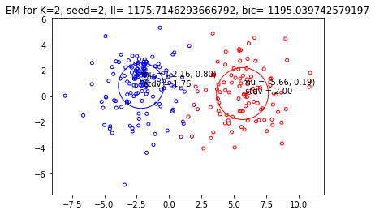
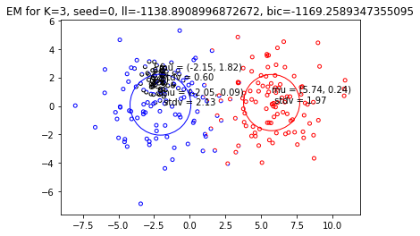
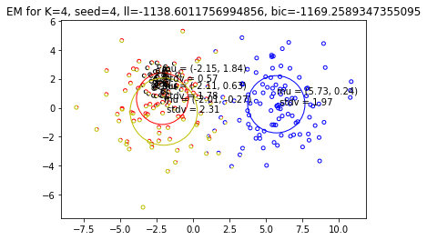
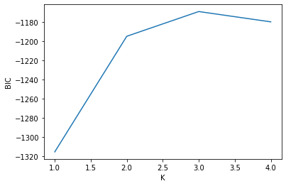

```python
import numpy as np
from matplotlib import pyplot as plt
import sys

sourcepath = '/Users/Pavel/Documents/repos/machine-learning/6.86x-ml-python/project4/netflix'
sys.path.insert(0,sourcepath)

#automatically track changes in the source code
%load_ext autoreload
%autoreload 2
```

    The autoreload extension is already loaded. To reload it, use:
      %reload_ext autoreload


# Project 4 of MITx 6.86x class on Machine Learning in Python


### Useful resources

Higher School of Economics ML course: 
* http://wiki.cs.hse.ru/Машинное_обучение_1
* http://wiki.cs.hse.ru/Машинное_обучение_2
* k-means https://github.com/esokolov/ml-course-hse/blob/master/2020-fall/lecture-notes/lecture11-unsupervised.pdf
* EM-algorithm, lecture: https://github.com/esokolov/ml-course-hse/blob/master/2020-spring/lecture-notes/lecture15-em.pdf
* EM-algorithm, derivation of the log-likelihood: https://github.com/esokolov/ml-course-hse/blob/master/2020-spring/seminars/sem15-em.pdf

# K-means algorithm

* k-means algorithm seeks to partition $l$ observations into $k$ clusters in which each observation belongs to the cluster with the nearest mean (clusters center or clusters centroid).


### Metrics of clusterisation quality

* Intra-cluster distance ("distortion cost")

$\sum_{k=1}^{K} \sum_{i=1}^{l} [Q(x_i) = C_k] \cdot \rho(x_i; c_k) \rightarrow min$,

where $[Q(x_i) = k]$ checks whether $x_i$ belongs to k-th cluster $C_k$ and $\rho$ is the distance from the i-th object, $x_i$, to the center, $c_k$, of the k-th cluster. For example, we could minimize the pairwise squared deviations of points in the same cluster:

$\sum_{k=1}^{K} \sum_{i\in C_k} |x_i - c_k|^2 \rightarrow min$


### Exercise

For this part of the project you will compare clustering obtained via K-means to the (soft) clustering induced by EM. In order to do so, our K-means algorithm will differ a bit from the one you learned. Here, the means are estimated exactly as before but the algorithm returns additional information. More specifically, we use the resulting clusters of points to estimate a Gaussian model for each cluster. Thus, our K-means algorithm actually returns a mixture model where the means of the component Gaussians are the 𝐾 centroids computed by the K-means algorithm. This is to make it such that we can now directly plot and compare solutions returned by the two algorithms as if they were both estimating mixtures.


Since the initialization is random, please use seeds 0,1,2,3,4 to and select the one that minimizes the total cost. 


```python
# import custom functions
import common as common
import kmeans as kmeans
```


```python
# import data
X = np.loadtxt("toy_data.txt")
```

## K = 1


```python
K=1
total_cost = []

for ii in range(0,5):
    gaussian_mix, post =  common.init(X=X,K=K,seed=ii)
    new_gaussian_mix, new_post, cost = kmeans.run(X=X,mixture=gaussian_mix,post=post)
    total_cost.append(cost)
    common.plot(X=X,mixture=new_gaussian_mix, post=new_post, title="K={}, seed ={}".format(str(K),str(ii)))

plt.plot(total_cost)
plt.xlabel("seed")
plt.ylabel("cost")
plt.show()

print("min cost for K = {} is ".format(str(K)), min(total_cost))
```


    min cost for K = 1 is  5462.297452340001


## K = 2


```python
K=2
total_cost = []

for ii in range(0,5):
    gaussian_mix, post =  common.init(X=X,K=K,seed=ii)
    new_gaussian_mix, new_post, cost = kmeans.run(X=X,mixture=gaussian_mix,post=post)
    total_cost.append(cost)
    common.plot(X=X,mixture=new_gaussian_mix, post=new_post, title="K={}, seed ={}".format(str(K),str(ii)))

plt.plot(total_cost)
plt.xlabel("seed")
plt.ylabel("cost")
plt.show()

print("min cost for K = {} is ".format(str(K)), min(total_cost))
```


    min cost for K = 2 is  1684.9079502962372


## K = 3


```python
K=3
total_cost = []

for ii in range(0,5):
    gaussian_mix, post =  common.init(X=X,K=K,seed=ii)
    new_gaussian_mix, new_post, cost = kmeans.run(X=X,mixture=gaussian_mix,post=post)
    total_cost.append(cost)
    common.plot(X=X,mixture=new_gaussian_mix, post=new_post, title="K={}, seed ={}".format(str(K),str(ii)))

plt.plot(total_cost)
plt.xlabel("seed")
plt.ylabel("cost")
plt.show()

print("min cost for K = {} is ".format(str(K)), min(total_cost))
```


    min cost for K = 3 is  1329.5948671544297


## K = 4


```python
K=4
total_cost = []

for ii in range(0,5):
    gaussian_mix, post =  common.init(X=X,K=K,seed=ii)
    new_gaussian_mix, new_post, cost = kmeans.run(X=X,mixture=gaussian_mix,post=post)
    total_cost.append(cost)
    common.plot(X=X,mixture=new_gaussian_mix, post=new_post, title="K={}, seed ={}".format(str(K),str(ii)))

plt.plot(total_cost)
plt.xlabel("seed")
plt.ylabel("cost")
plt.show()

print("min cost for K = {} = ".format(str(K)), min(total_cost))
```


    min cost for K = 4 is  1035.4998265394659


# EM algorithm

### Exercise

Generate analogous plots to K-means using your EM implementation. Note that the EM algorithm can also get stuck in a locally optimal solution. For each value of 𝐾, please run the EM algorithm with seeds 0,1,2,3,4 and select the solution that achieves the highest log-likelihood. Compare the K-means and mixture solutions for 𝐾=[1,2,3,4]. Ask yourself when, how, and why they differ.


```python
import naive_em as naive_em
```

# K = 1 


```python
K=1
total_cost_em = []
total_cost_km = []

for ii in range(0,5):
    gaussian_mix, post =  common.init(X=X,K=K,seed=ii)
    new_gaussian_mix_em, new_post_em, cost_em = naive_em.run(X=X,mixture=gaussian_mix,post=post)
    total_cost_em.append(cost_em)
    new_gaussian_mix_km, new_post_km, cost_km = kmeans.run(X=X,mixture=gaussian_mix,post=post)
    total_cost_km.append(cost_km)
    common.plot_both(X=X,
                    mixture_km=new_gaussian_mix_km, post_km=new_post_km, title_km="k-means algorithm, K={}, seed ={}".format(str(K),str(ii)),
                    mixture_em=new_gaussian_mix_em, post_em=new_post_em, title_em="EM algorithm, K={}, seed ={}".format(str(K),str(ii)))
plt.plot(total_cost_em)
plt.xlabel("seed")
plt.ylabel("cost EM")
plt.show()
plt.plot(total_cost_km)
plt.xlabel("seed")
plt.ylabel("cost k-means")
plt.show()

print("EM max likelihood for K = {} = ".format(str(K)), max(total_cost_em))
print("k-means min cost for K = {} = ".format(str(K)), min(total_cost_km))
```


    EM max likelihood for K = 1 =  -1307.2234317600942
    k-means min cost for K = 1 =  5462.297452340001


### k-means and EM-algorithm comparison for K=2: 

he results for 𝐾=1 case are exactly the same for k-ameans and EM-algorithm. All the data are assigned to the same cluster.

# K = 2 


```python
K=2
total_cost_em = []
total_cost_km = []

for ii in range(0,5):
    gaussian_mix, post =  common.init(X=X,K=K,seed=ii)
    new_gaussian_mix_em, new_post_em, cost_em = naive_em.run(X=X,mixture=gaussian_mix,post=post)
    total_cost_em.append(cost_em)
    new_gaussian_mix_km, new_post_km, cost_km = kmeans.run(X=X,mixture=gaussian_mix,post=post)
    total_cost_km.append(cost_km)
    common.plot_both(X=X,
                    mixture_km=new_gaussian_mix_km, post_km=new_post_km, title_km="k-means algorithm, K={}, seed ={}".format(str(K),str(ii)),
                    mixture_em=new_gaussian_mix_em, post_em=new_post_em, title_em="EM algorithm, K={}, seed ={}".format(str(K),str(ii)))
plt.plot(total_cost_em)
plt.xlabel("seed")
plt.ylabel("cost EM")
plt.show()
plt.plot(total_cost_km)
plt.xlabel("seed")
plt.ylabel("cost k-means")
plt.show()

print("EM max likelihood for K = {} = ".format(str(K)), max(total_cost_em))
print("k-means min cost for K = {} = ".format(str(K)), min(total_cost_km))
```


    EM max likelihood for K = 2 =  -1175.7146293666792
    k-means min cost for K = 2 =  1684.9079502962372


### k-means and EM-algorithm comparison for K=2: 

Resulting clusters are very similar in terms of their mean and point assignment. Because the EM algorithm uses soft  assignment model, the points in the middle belong to both clusters, just with different probabilities.

# K = 3


```python
K=3
total_cost_em = []
total_cost_km = []

for ii in range(0,5):
    gaussian_mix, post =  common.init(X=X,K=K,seed=ii)
    new_gaussian_mix_em, new_post_em, cost_em = naive_em.run(X=X,mixture=gaussian_mix,post=post)
    total_cost_em.append(cost_em)
    new_gaussian_mix_km, new_post_km, cost_km = kmeans.run(X=X,mixture=gaussian_mix,post=post)
    total_cost_km.append(cost_km)
    common.plot_both(X=X,
                    mixture_km=new_gaussian_mix_km, post_km=new_post_km, title_km="k-means algorithm, K={}, seed ={}".format(str(K),str(ii)),
                    mixture_em=new_gaussian_mix_em, post_em=new_post_em, title_em="EM algorithm, K={}, seed ={}".format(str(K),str(ii)))
plt.plot(total_cost_em)
plt.xlabel("seed")
plt.ylabel("cost EM")
plt.show()
plt.plot(total_cost_km)
plt.xlabel("seed")
plt.ylabel("cost k-means")
plt.show()

print("EM max likelihood for K = {} = ".format(str(K)), max(total_cost_em))
print("k-means min cost for K = {} = ".format(str(K)), min(total_cost_km))
```


    EM max likelihood for K = 3 =  -1138.8908996872672
    k-means min cost for K = 3 =  1329.5948671544297


### k-means and EM-algorithm comparison for K=3: 

The clusters delivered by the k-means algorithm are grouped so as to minimize the intra-cluster distance metric (distortion cost). 

On the contrary, the left two clusters delivered by the EM algorithm are closely packed with very different variances. This is probably because the EM algoroithm accounts more for the higher density of points on the left side. 

# K = 4


```python
K=4
total_cost_em = []
total_cost_km = []

for ii in range(0,5):
    gaussian_mix, post =  common.init(X=X,K=K,seed=ii)
    new_gaussian_mix_em, new_post_em, cost_em = naive_em.run(X=X,mixture=gaussian_mix,post=post)
    total_cost_em.append(cost_em)
    new_gaussian_mix_km, new_post_km, cost_km = kmeans.run(X=X,mixture=gaussian_mix,post=post)
    total_cost_km.append(cost_km)
    common.plot_both(X=X,
                    mixture_km=new_gaussian_mix_km, post_km=new_post_km, title_km="k-means algorithm, K={}, seed ={}".format(str(K),str(ii)),
                    mixture_em=new_gaussian_mix_em, post_em=new_post_em, title_em="EM algorithm, K={}, seed ={}".format(str(K),str(ii)))
plt.plot(total_cost_em)
plt.xlabel("seed")
plt.ylabel("cost EM")
plt.show()
plt.plot(total_cost_km)
plt.xlabel("seed")
plt.ylabel("cost k-means")
plt.show()

print("EM max likelihood for K = {} = ".format(str(K)), max(total_cost_em))
print("k-means min cost for K = {} = ".format(str(K)), min(total_cost_km))
```





    EM max likelihood for K = 4 =  -1138.6011756994856
    k-means min cost for K = 4 =  1035.4998265394659


The same reasoning as for the K=3 case.

# Bayesian information criterion

BIC is a criterion for model selection that offers  a trade-off between the log-likelihood of he data and the number of parameters used by the model. We look for the model that has the highest BIC:

$BIC = L - 0.5 \cdot n_p \cdot log n_d$,

where $L$ is the max log-likelihood of the data used for the model, $n_p$ is he number of free parameters and $n_d$ is the number of data points.


```python
max_bic = None
max_bic2plot = []
K2plot = []
#
# go thru different clusters
for K in range(1, 5):
    K2plot.append(K)
    max_ll = None
    best_seed = None
    #
    # go thru different seeds
    for seed in range(0, 5):
        #
        # initialize and run the EM to get the mixture and log-likelihood for the current seed and K
        mixture, post = common.init(X, K, seed)
        mixture, post, ll = naive_em.run(X, mixture, post)
        #
        # check if likelihood is the largest, if yes, then update the best seed
        if max_ll is None or ll > max_ll:
            max_ll = ll
            best_seed = seed
    #
    # run the EM again, this time with the best seed
    mixture, post = common.init(X, K, best_seed)
    mixture, post, ll = naive_em.run(X, mixture, post)
    #
    # run BIC to get the quality metric for the current number of clusters
    bic = common.bic(X, mixture, ll)
    #
    # update the best BIC
    if max_bic is None or bic > max_bic:
        max_bic = bic
        max_bic2plot.append(max_bic)
    else:
        max_bic2plot.append(bic)
    # print results
    title = "EM for K={}, seed={}, ll={}, bic={}".format(K, best_seed, ll, max_bic)
    print(title)
    common.plot(X, mixture, post, title)
    
plt.plot(K2plot,max_bic2plot)
plt.xlabel("K")
plt.ylabel("BIC")
plt.show()
```

    EM for K=1, seed=0, ll=-1307.2234317600942, bic=-1315.5056231368876





    EM for K=2, seed=2, ll=-1175.7146293666792, bic=-1195.039742579197





    EM for K=3, seed=0, ll=-1138.8908996872672, bic=-1169.2589347355095





    EM for K=4, seed=4, ll=-1138.6011756994856, bic=-1169.2589347355095








> As per BIC, the model with 3 Gaussians has a better fit to the data than other models. 


```python

```
