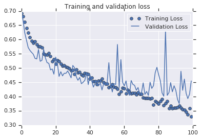

##### Copyright 2019 The TensorFlow Authors.

# Image classification with and without data augmentation. Cats-vs-dogs example.


```
#@title Licensed under the Apache License, Version 2.0 (the "License");
# you may not use this file except in compliance with the License.
# You may obtain a copy of the License at
#
# https://www.apache.org/licenses/LICENSE-2.0
#
# Unless required by applicable law or agreed to in writing, software
# distributed under the License is distributed on an "AS IS" BASIS,
# WITHOUT WARRANTIES OR CONDITIONS OF ANY KIND, either express or implied.
# See the License for the specific language governing permissions and
# limitations under the License.
```

# No data augmentation

Let's start with a model that's very effective at learning Cats v Dogs.

It's similar to the previous models that you have used, but I have updated the layers definition. Note that there are now 4 convolutional layers with 32, 64, 128 and 128 convolutions respectively.

Also, this will train for 100 epochs, because I want to plot the graph of loss and accuracy.


```
!wget --no-check-certificate \
    https://storage.googleapis.com/mledu-datasets/cats_and_dogs_filtered.zip \
    -O /tmp/cats_and_dogs_filtered.zip
  
import os
import zipfile
import tensorflow as tf
from tensorflow.keras.optimizers import RMSprop
from tensorflow.keras.preprocessing.image import ImageDataGenerator

local_zip = '/tmp/cats_and_dogs_filtered.zip'
zip_ref = zipfile.ZipFile(local_zip, 'r')
zip_ref.extractall('/tmp')
zip_ref.close()

base_dir = '/tmp/cats_and_dogs_filtered'
train_dir = os.path.join(base_dir, 'train')
validation_dir = os.path.join(base_dir, 'validation')

# Directory with our training cat pictures
train_cats_dir = os.path.join(train_dir, 'cats')

# Directory with our training dog pictures
train_dogs_dir = os.path.join(train_dir, 'dogs')

# Directory with our validation cat pictures
validation_cats_dir = os.path.join(validation_dir, 'cats')

# Directory with our validation dog pictures
validation_dogs_dir = os.path.join(validation_dir, 'dogs')

model = tf.keras.models.Sequential([
    tf.keras.layers.Conv2D(32, (3,3), activation='relu', input_shape=(150, 150, 3)),
    tf.keras.layers.MaxPooling2D(2, 2),
    tf.keras.layers.Conv2D(64, (3,3), activation='relu'),
    tf.keras.layers.MaxPooling2D(2,2),
    tf.keras.layers.Conv2D(128, (3,3), activation='relu'),
    tf.keras.layers.MaxPooling2D(2,2),
    tf.keras.layers.Conv2D(128, (3,3), activation='relu'),
    tf.keras.layers.MaxPooling2D(2,2),
    tf.keras.layers.Flatten(),
    tf.keras.layers.Dense(512, activation='relu'),
    tf.keras.layers.Dense(1, activation='sigmoid')
])

model.compile(loss='binary_crossentropy',
              optimizer=RMSprop(lr=1e-4),
              metrics=['accuracy'])

# All images will be rescaled by 1./255
train_datagen = ImageDataGenerator(rescale=1./255)
test_datagen = ImageDataGenerator(rescale=1./255)

# Flow training images in batches of 20 using train_datagen generator
train_generator = train_datagen.flow_from_directory(
        train_dir,  # This is the source directory for training images
        target_size=(150, 150),  # All images will be resized to 150x150
        batch_size=20,
        # Since we use binary_crossentropy loss, we need binary labels
        class_mode='binary')

# Flow validation images in batches of 20 using test_datagen generator
validation_generator = test_datagen.flow_from_directory(
        validation_dir,
        target_size=(150, 150),
        batch_size=20,
        class_mode='binary')

history = model.fit(
      train_generator,
      steps_per_epoch=100,  # 2000 images = batch_size * steps
      epochs=100,
      validation_data=validation_generator,
      validation_steps=50,  # 1000 images = batch_size * steps
      verbose=2)

```


```
import matplotlib.pyplot as plt
acc = history.history['accuracy']
val_acc = history.history['val_accuracy']
loss = history.history['loss']
val_loss = history.history['val_loss']

epochs = range(len(acc))

plt.plot(epochs, acc, 'bo', label='Training accuracy')
plt.plot(epochs, val_acc, 'b', label='Validation accuracy')
plt.title('Training and validation accuracy')

plt.figure()

plt.plot(epochs, loss, 'bo', label='Training Loss')
plt.plot(epochs, val_loss, 'b', label='Validation Loss')
plt.title('Training and validation loss')
plt.legend()

plt.show()
```


The Training Accuracy is close to 100%, and the validation accuracy is in the 70%-80% range. This is a great example of overfitting -- which in short means that it can do very well with images it has seen before, but not so well with images it hasn't. Let's see if we can do better to avoid overfitting -- and one simple method is to augment the images a bit. If you think about it, most pictures of a cat are very similar -- the ears are at the top, then the eyes, then the mouth etc. Things like the distance between the eyes and ears will always be quite similar too. 

# With data augmentation

What if we tweak with the images to change this up a bit -- rotate the image, squash it, etc.  That's what image augementation is all about. And there's an API that makes it easy...

Now take a look at the ImageGenerator. There are properties on it that you can use to augment the image. 

```
# Updated to do image augmentation
train_datagen = ImageDataGenerator(
      rotation_range=40,
      width_shift_range=0.2,
      height_shift_range=0.2,
      shear_range=0.2,
      zoom_range=0.2,
      horizontal_flip=True,
      fill_mode='nearest')
```
These are just a few of the options available (for more, see the Keras documentation. Let's quickly go over what we just wrote:

* rotation_range is a value in degrees (0–180), a range within which to randomly rotate pictures.
* width_shift and height_shift are ranges (as a fraction of total width or height) within which to randomly translate pictures vertically or horizontally.
* shear_range is for randomly applying shearing transformations.
* zoom_range is for randomly zooming inside pictures.
* horizontal_flip is for randomly flipping half of the images horizontally. This is relevant when there are no assumptions of horizontal assymmetry (e.g. real-world pictures).
* fill_mode is the strategy used for filling in newly created pixels, which can appear after a rotation or a width/height shift.


Here's some code where we've added Image Augmentation. Run it to see the impact.


```
!wget --no-check-certificate \
    https://storage.googleapis.com/mledu-datasets/cats_and_dogs_filtered.zip \
    -O /tmp/cats_and_dogs_filtered.zip
  
import os
import zipfile
import tensorflow as tf
from tensorflow.keras.optimizers import RMSprop
from tensorflow.keras.preprocessing.image import ImageDataGenerator

local_zip = '/tmp/cats_and_dogs_filtered.zip'
zip_ref = zipfile.ZipFile(local_zip, 'r')
zip_ref.extractall('/tmp')
zip_ref.close()

base_dir = '/tmp/cats_and_dogs_filtered'
train_dir = os.path.join(base_dir, 'train')
validation_dir = os.path.join(base_dir, 'validation')

# Directory with our training cat pictures
train_cats_dir = os.path.join(train_dir, 'cats')

# Directory with our training dog pictures
train_dogs_dir = os.path.join(train_dir, 'dogs')

# Directory with our validation cat pictures
validation_cats_dir = os.path.join(validation_dir, 'cats')

# Directory with our validation dog pictures
validation_dogs_dir = os.path.join(validation_dir, 'dogs')

model = tf.keras.models.Sequential([
    tf.keras.layers.Conv2D(32, (3,3), activation='relu', input_shape=(150, 150, 3)),
    tf.keras.layers.MaxPooling2D(2, 2),
    tf.keras.layers.Conv2D(64, (3,3), activation='relu'),
    tf.keras.layers.MaxPooling2D(2,2),
    tf.keras.layers.Conv2D(128, (3,3), activation='relu'),
    tf.keras.layers.MaxPooling2D(2,2),
    tf.keras.layers.Conv2D(128, (3,3), activation='relu'),
    tf.keras.layers.MaxPooling2D(2,2),
    tf.keras.layers.Flatten(),
    tf.keras.layers.Dense(512, activation='relu'),
    tf.keras.layers.Dense(1, activation='sigmoid')
])

model.compile(loss='binary_crossentropy',
              optimizer=RMSprop(lr=1e-4),
              metrics=['accuracy'])

# This code has changed. Now instead of the ImageGenerator just rescaling
# the image, we also rotate and do other operations
# Updated to do image augmentation
train_datagen = ImageDataGenerator(
      rescale=1./255,
      rotation_range=40,
      width_shift_range=0.2,
      height_shift_range=0.2,
      shear_range=0.2,
      zoom_range=0.2,
      horizontal_flip=True,
      fill_mode='nearest')

test_datagen = ImageDataGenerator(rescale=1./255)

# Flow training images in batches of 20 using train_datagen generator
train_generator = train_datagen.flow_from_directory(
        train_dir,  # This is the source directory for training images
        target_size=(150, 150),  # All images will be resized to 150x150
        batch_size=20,
        # Since we use binary_crossentropy loss, we need binary labels
        class_mode='binary')

# Flow validation images in batches of 20 using test_datagen generator
validation_generator = test_datagen.flow_from_directory(
        validation_dir,
        target_size=(150, 150),
        batch_size=20,
        class_mode='binary')

history = model.fit(
      train_generator,
      steps_per_epoch=100,  # 2000 images = batch_size * steps
      epochs=100,
      validation_data=validation_generator,
      validation_steps=50,  # 1000 images = batch_size * steps
      verbose=2)
```


```
import matplotlib.pyplot as plt
acc = history.history['accuracy']
val_acc = history.history['val_accuracy']
loss = history.history['loss']
val_loss = history.history['val_loss']

epochs = range(len(acc))

plt.plot(epochs, acc, 'bo', label='Training accuracy')
plt.plot(epochs, val_acc, 'b', label='Validation accuracy')
plt.title('Training and validation accuracy')

plt.figure()

plt.plot(epochs, loss, 'bo', label='Training Loss')
plt.plot(epochs, val_loss, 'b', label='Validation Loss')
plt.title('Training and validation loss')
plt.legend()

plt.show()
```





```
!wget --no-check-certificate \
    https://storage.googleapis.com/mledu-datasets/cats_and_dogs_filtered.zip \
    -O /tmp/cats_and_dogs_filtered.zip
  
import os
import zipfile
import tensorflow as tf
from tensorflow.keras.optimizers import RMSprop
from tensorflow.keras.preprocessing.image import ImageDataGenerator

local_zip = '/tmp/cats_and_dogs_filtered.zip'
zip_ref = zipfile.ZipFile(local_zip, 'r')
zip_ref.extractall('/tmp')
zip_ref.close()

base_dir = '/tmp/cats_and_dogs_filtered'
train_dir = os.path.join(base_dir, 'train')
validation_dir = os.path.join(base_dir, 'validation')

# Directory with our training cat pictures
train_cats_dir = os.path.join(train_dir, 'cats')

# Directory with our training dog pictures
train_dogs_dir = os.path.join(train_dir, 'dogs')

# Directory with our validation cat pictures
validation_cats_dir = os.path.join(validation_dir, 'cats')

# Directory with our validation dog pictures
validation_dogs_dir = os.path.join(validation_dir, 'dogs')

model = tf.keras.models.Sequential([
    tf.keras.layers.Conv2D(32, (3,3), activation='relu', input_shape=(150, 150, 3)),
    tf.keras.layers.MaxPooling2D(2, 2),
    tf.keras.layers.Conv2D(64, (3,3), activation='relu'),
    tf.keras.layers.MaxPooling2D(2,2),
    tf.keras.layers.Conv2D(128, (3,3), activation='relu'),
    tf.keras.layers.MaxPooling2D(2,2),
    tf.keras.layers.Conv2D(128, (3,3), activation='relu'),
    tf.keras.layers.MaxPooling2D(2,2),
    tf.keras.layers.Dropout(0.5),
    tf.keras.layers.Flatten(),
    tf.keras.layers.Dense(512, activation='relu'),
    tf.keras.layers.Dense(1, activation='sigmoid')
])

model.compile(loss='binary_crossentropy',
              optimizer=RMSprop(lr=1e-4),
              metrics=['accuracy'])

# This code has changed. Now instead of the ImageGenerator just rescaling
# the image, we also rotate and do other operations
# Updated to do image augmentation
train_datagen = ImageDataGenerator(
      rescale=1./255,
      rotation_range=40,
      width_shift_range=0.2,
      height_shift_range=0.2,
      shear_range=0.2,
      zoom_range=0.2,
      horizontal_flip=True,
      fill_mode='nearest')

test_datagen = ImageDataGenerator(rescale=1./255)

# Flow training images in batches of 20 using train_datagen generator
train_generator = train_datagen.flow_from_directory(
        train_dir,  # This is the source directory for training images
        target_size=(150, 150),  # All images will be resized to 150x150
        batch_size=20,
        # Since we use binary_crossentropy loss, we need binary labels
        class_mode='binary')

# Flow validation images in batches of 20 using test_datagen generator
validation_generator = test_datagen.flow_from_directory(
        validation_dir,
        target_size=(150, 150),
        batch_size=20,
        class_mode='binary')

history = model.fit(
      train_generator,
      steps_per_epoch=100,  # 2000 images = batch_size * steps
      epochs=100,
      validation_data=validation_generator,
      validation_steps=50,  # 1000 images = batch_size * steps
      verbose=2)
```

    --2019-02-12 07:59:45--  https://storage.googleapis.com/mledu-datasets/cats_and_dogs_filtered.zip
    Resolving storage.googleapis.com... 2607:f8b0:4001:c1c::80, 173.194.197.128
    Connecting to storage.googleapis.com|2607:f8b0:4001:c1c::80|:443... connected.
    WARNING: cannot verify storage.googleapis.com's certificate, issued by 'CN=Google Internet Authority G3,O=Google Trust Services,C=US':
      Unable to locally verify the issuer's authority.
    HTTP request sent, awaiting response... 200 OK
    Length: 68606236 (65M) [application/zip]
    Saving to: '/tmp/cats_and_dogs_filtered.zip'
    
    /tmp/cats_and_dogs_ 100%[=====================>]  65.43M   243MB/s   in 0.3s   
    
    2019-02-12 07:59:46 (243 MB/s) - '/tmp/cats_and_dogs_filtered.zip' saved [68606236/68606236]
    
    Found 2000 images belonging to 2 classes.
    Found 1000 images belonging to 2 classes.
    Epoch 1/100
    100/100 - 14s - loss: 0.6931 - acc: 0.5350 - val_loss: 0.6907 - val_acc: 0.5080
    Epoch 2/100
    100/100 - 14s - loss: 0.6855 - acc: 0.5400 - val_loss: 0.6660 - val_acc: 0.6200
    Epoch 3/100
    100/100 - 13s - loss: 0.6702 - acc: 0.5810 - val_loss: 0.6665 - val_acc: 0.5650
    Epoch 4/100
    100/100 - 13s - loss: 0.6541 - acc: 0.6000 - val_loss: 0.6342 - val_acc: 0.6300
    Epoch 5/100
    100/100 - 14s - loss: 0.6415 - acc: 0.6180 - val_loss: 0.6457 - val_acc: 0.5920
    Epoch 6/100
    100/100 - 13s - loss: 0.6248 - acc: 0.6495 - val_loss: 0.5875 - val_acc: 0.6840
    Epoch 7/100
    100/100 - 13s - loss: 0.6115 - acc: 0.6575 - val_loss: 0.5864 - val_acc: 0.6810
    Epoch 8/100
    100/100 - 13s - loss: 0.6010 - acc: 0.6780 - val_loss: 0.5550 - val_acc: 0.7130
    Epoch 9/100
    100/100 - 14s - loss: 0.5972 - acc: 0.6670 - val_loss: 0.5640 - val_acc: 0.7020
    Epoch 10/100
    100/100 - 14s - loss: 0.5877 - acc: 0.6920 - val_loss: 0.5830 - val_acc: 0.6900
    Epoch 11/100
    100/100 - 14s - loss: 0.5761 - acc: 0.7055 - val_loss: 0.5663 - val_acc: 0.7030
    Epoch 12/100
    100/100 - 14s - loss: 0.5708 - acc: 0.7100 - val_loss: 0.5662 - val_acc: 0.7030
    Epoch 13/100
    100/100 - 14s - loss: 0.5810 - acc: 0.6935 - val_loss: 0.5600 - val_acc: 0.6980
    Epoch 14/100
    100/100 - 14s - loss: 0.5734 - acc: 0.7025 - val_loss: 0.5253 - val_acc: 0.7220
    Epoch 15/100
    100/100 - 13s - loss: 0.5616 - acc: 0.7150 - val_loss: 0.6329 - val_acc: 0.6470
    Epoch 16/100
    100/100 - 14s - loss: 0.5487 - acc: 0.7150 - val_loss: 0.5577 - val_acc: 0.7160
    Epoch 17/100
    100/100 - 13s - loss: 0.5575 - acc: 0.7180 - val_loss: 0.5160 - val_acc: 0.7390
    Epoch 18/100
    100/100 - 13s - loss: 0.5481 - acc: 0.7250 - val_loss: 0.5057 - val_acc: 0.7360
    Epoch 19/100
    100/100 - 14s - loss: 0.5398 - acc: 0.7285 - val_loss: 0.5052 - val_acc: 0.7320
    Epoch 20/100
    100/100 - 13s - loss: 0.5448 - acc: 0.7240 - val_loss: 0.4988 - val_acc: 0.7560
    Epoch 21/100
    100/100 - 13s - loss: 0.5321 - acc: 0.7345 - val_loss: 0.5014 - val_acc: 0.7500
    Epoch 22/100
    100/100 - 13s - loss: 0.5379 - acc: 0.7295 - val_loss: 0.4910 - val_acc: 0.7500
    Epoch 23/100
    100/100 - 13s - loss: 0.5211 - acc: 0.7395 - val_loss: 0.4985 - val_acc: 0.7400
    Epoch 24/100
    100/100 - 14s - loss: 0.5236 - acc: 0.7420 - val_loss: 0.5055 - val_acc: 0.7410
    Epoch 25/100
    100/100 - 13s - loss: 0.5206 - acc: 0.7360 - val_loss: 0.4907 - val_acc: 0.7550
    Epoch 26/100
    100/100 - 14s - loss: 0.5234 - acc: 0.7310 - val_loss: 0.4880 - val_acc: 0.7430
    Epoch 27/100
    100/100 - 13s - loss: 0.5126 - acc: 0.7470 - val_loss: 0.4863 - val_acc: 0.7510
    Epoch 28/100
    100/100 - 13s - loss: 0.5086 - acc: 0.7545 - val_loss: 0.5446 - val_acc: 0.7160
    Epoch 29/100
    100/100 - 13s - loss: 0.5237 - acc: 0.7330 - val_loss: 0.5041 - val_acc: 0.7470
    Epoch 30/100
    100/100 - 13s - loss: 0.5077 - acc: 0.7475 - val_loss: 0.4819 - val_acc: 0.7510
    Epoch 31/100
    100/100 - 13s - loss: 0.5134 - acc: 0.7425 - val_loss: 0.4766 - val_acc: 0.7480
    Epoch 32/100
    100/100 - 13s - loss: 0.5066 - acc: 0.7535 - val_loss: 0.5445 - val_acc: 0.7220
    Epoch 33/100
    100/100 - 13s - loss: 0.5005 - acc: 0.7535 - val_loss: 0.4800 - val_acc: 0.7490
    Epoch 34/100
    100/100 - 13s - loss: 0.5027 - acc: 0.7625 - val_loss: 0.4992 - val_acc: 0.7570
    Epoch 35/100
    100/100 - 13s - loss: 0.5069 - acc: 0.7565 - val_loss: 0.5262 - val_acc: 0.7460
    Epoch 36/100
    100/100 - 13s - loss: 0.5000 - acc: 0.7560 - val_loss: 0.4814 - val_acc: 0.7500
    Epoch 37/100
    100/100 - 13s - loss: 0.4965 - acc: 0.7595 - val_loss: 0.4773 - val_acc: 0.7650
    Epoch 38/100
    100/100 - 13s - loss: 0.4830 - acc: 0.7665 - val_loss: 0.4946 - val_acc: 0.7370
    Epoch 39/100
    100/100 - 13s - loss: 0.4884 - acc: 0.7635 - val_loss: 0.4844 - val_acc: 0.7500
    Epoch 40/100
    100/100 - 13s - loss: 0.4742 - acc: 0.7745 - val_loss: 0.4790 - val_acc: 0.7500
    Epoch 41/100
    100/100 - 13s - loss: 0.4752 - acc: 0.7760 - val_loss: 0.4774 - val_acc: 0.7550
    Epoch 42/100
    100/100 - 13s - loss: 0.4743 - acc: 0.7655 - val_loss: 0.4838 - val_acc: 0.7700
    Epoch 43/100
    100/100 - 13s - loss: 0.4805 - acc: 0.7725 - val_loss: 0.4712 - val_acc: 0.7780
    Epoch 44/100
    100/100 - 13s - loss: 0.4706 - acc: 0.7790 - val_loss: 0.4564 - val_acc: 0.7840
    Epoch 45/100
    100/100 - 13s - loss: 0.4730 - acc: 0.7785 - val_loss: 0.4546 - val_acc: 0.7890
    Epoch 46/100
    100/100 - 13s - loss: 0.4762 - acc: 0.7835 - val_loss: 0.4599 - val_acc: 0.7570
    Epoch 47/100
    100/100 - 13s - loss: 0.4656 - acc: 0.7785 - val_loss: 0.4936 - val_acc: 0.7450
    Epoch 48/100
    100/100 - 13s - loss: 0.4719 - acc: 0.7685 - val_loss: 0.4557 - val_acc: 0.7910
    Epoch 49/100
    100/100 - 13s - loss: 0.4671 - acc: 0.7755 - val_loss: 0.4599 - val_acc: 0.7930
    Epoch 50/100
    100/100 - 13s - loss: 0.4559 - acc: 0.7815 - val_loss: 0.4702 - val_acc: 0.7620
    Epoch 51/100
    100/100 - 13s - loss: 0.4663 - acc: 0.7725 - val_loss: 0.5053 - val_acc: 0.7500
    Epoch 52/100
    100/100 - 13s - loss: 0.4641 - acc: 0.7715 - val_loss: 0.4698 - val_acc: 0.7700
    Epoch 53/100
    100/100 - 13s - loss: 0.4549 - acc: 0.7900 - val_loss: 0.4361 - val_acc: 0.7950
    Epoch 54/100
    100/100 - 13s - loss: 0.4506 - acc: 0.7835 - val_loss: 0.4389 - val_acc: 0.8000
    Epoch 55/100
    100/100 - 13s - loss: 0.4462 - acc: 0.7890 - val_loss: 0.4503 - val_acc: 0.7730
    Epoch 56/100
    100/100 - 13s - loss: 0.4399 - acc: 0.7975 - val_loss: 0.4550 - val_acc: 0.7860
    Epoch 57/100
    100/100 - 13s - loss: 0.4473 - acc: 0.7905 - val_loss: 0.4416 - val_acc: 0.7980
    Epoch 58/100
    100/100 - 13s - loss: 0.4471 - acc: 0.7880 - val_loss: 0.4301 - val_acc: 0.8070
    Epoch 59/100
    100/100 - 13s - loss: 0.4310 - acc: 0.8005 - val_loss: 0.4300 - val_acc: 0.7980
    Epoch 60/100
    100/100 - 13s - loss: 0.4435 - acc: 0.7960 - val_loss: 0.4549 - val_acc: 0.7950
    Epoch 61/100
    100/100 - 13s - loss: 0.4436 - acc: 0.7910 - val_loss: 0.4562 - val_acc: 0.7710
    Epoch 62/100
    100/100 - 13s - loss: 0.4402 - acc: 0.7975 - val_loss: 0.4704 - val_acc: 0.7740
    Epoch 63/100
    100/100 - 13s - loss: 0.4225 - acc: 0.8125 - val_loss: 0.4337 - val_acc: 0.8020
    Epoch 64/100
    100/100 - 13s - loss: 0.4312 - acc: 0.7975 - val_loss: 0.4532 - val_acc: 0.7800
    Epoch 65/100
    100/100 - 13s - loss: 0.4314 - acc: 0.8000 - val_loss: 0.4433 - val_acc: 0.7990
    Epoch 66/100
    100/100 - 12s - loss: 0.4273 - acc: 0.8055 - val_loss: 0.4204 - val_acc: 0.8030
    Epoch 67/100
    100/100 - 12s - loss: 0.4427 - acc: 0.7950 - val_loss: 0.4254 - val_acc: 0.8040
    Epoch 68/100
    100/100 - 12s - loss: 0.4229 - acc: 0.8055 - val_loss: 0.4383 - val_acc: 0.7950
    Epoch 69/100
    100/100 - 12s - loss: 0.4116 - acc: 0.8150 - val_loss: 0.4749 - val_acc: 0.7670
    Epoch 70/100
    100/100 - 13s - loss: 0.4167 - acc: 0.8125 - val_loss: 0.4388 - val_acc: 0.7950
    Epoch 71/100
    100/100 - 13s - loss: 0.4216 - acc: 0.8015 - val_loss: 0.4123 - val_acc: 0.8240
    Epoch 72/100
    100/100 - 13s - loss: 0.4165 - acc: 0.8075 - val_loss: 0.4087 - val_acc: 0.8060
    Epoch 73/100
    100/100 - 13s - loss: 0.4048 - acc: 0.8105 - val_loss: 0.4676 - val_acc: 0.7890
    Epoch 74/100
    100/100 - 13s - loss: 0.4071 - acc: 0.8185 - val_loss: 0.4029 - val_acc: 0.8140
    Epoch 75/100
    100/100 - 13s - loss: 0.4111 - acc: 0.8205 - val_loss: 0.4629 - val_acc: 0.7800
    Epoch 76/100
    100/100 - 13s - loss: 0.4103 - acc: 0.8145 - val_loss: 0.4440 - val_acc: 0.8040
    Epoch 77/100
    100/100 - 13s - loss: 0.4101 - acc: 0.8110 - val_loss: 0.4412 - val_acc: 0.7920
    Epoch 78/100
    100/100 - 13s - loss: 0.4050 - acc: 0.8095 - val_loss: 0.4516 - val_acc: 0.7890
    Epoch 79/100
    100/100 - 13s - loss: 0.4211 - acc: 0.8060 - val_loss: 0.4109 - val_acc: 0.8020
    Epoch 80/100
    100/100 - 13s - loss: 0.4120 - acc: 0.8070 - val_loss: 0.3999 - val_acc: 0.8190
    Epoch 81/100
    100/100 - 13s - loss: 0.4064 - acc: 0.8215 - val_loss: 0.4246 - val_acc: 0.8010
    Epoch 82/100
    100/100 - 13s - loss: 0.4150 - acc: 0.8100 - val_loss: 0.4260 - val_acc: 0.8120
    Epoch 83/100
    100/100 - 13s - loss: 0.3988 - acc: 0.8195 - val_loss: 0.4198 - val_acc: 0.8090
    Epoch 84/100
    100/100 - 13s - loss: 0.3964 - acc: 0.8265 - val_loss: 0.4204 - val_acc: 0.8080
    Epoch 85/100
    100/100 - 13s - loss: 0.3946 - acc: 0.8200 - val_loss: 0.4179 - val_acc: 0.8060
    Epoch 86/100
    100/100 - 13s - loss: 0.4067 - acc: 0.8170 - val_loss: 0.4001 - val_acc: 0.8210
    Epoch 87/100
    100/100 - 13s - loss: 0.4072 - acc: 0.8135 - val_loss: 0.4360 - val_acc: 0.8010
    Epoch 88/100
    100/100 - 13s - loss: 0.4049 - acc: 0.8090 - val_loss: 0.4009 - val_acc: 0.8220
    Epoch 89/100
    100/100 - 13s - loss: 0.3992 - acc: 0.8170 - val_loss: 0.4432 - val_acc: 0.7840
    Epoch 90/100
    100/100 - 13s - loss: 0.3868 - acc: 0.8280 - val_loss: 0.4135 - val_acc: 0.8140
    Epoch 91/100
    100/100 - 13s - loss: 0.3855 - acc: 0.8310 - val_loss: 0.4134 - val_acc: 0.8100
    Epoch 92/100
    100/100 - 13s - loss: 0.3789 - acc: 0.8340 - val_loss: 0.4227 - val_acc: 0.8170
    Epoch 93/100
    100/100 - 13s - loss: 0.3828 - acc: 0.8295 - val_loss: 0.4429 - val_acc: 0.8120
    Epoch 94/100
    100/100 - 13s - loss: 0.3903 - acc: 0.8260 - val_loss: 0.4364 - val_acc: 0.8030
    Epoch 95/100
    100/100 - 13s - loss: 0.3718 - acc: 0.8385 - val_loss: 0.4082 - val_acc: 0.8280
    Epoch 96/100
    100/100 - 13s - loss: 0.3831 - acc: 0.8305 - val_loss: 0.3946 - val_acc: 0.8240
    Epoch 97/100
    100/100 - 13s - loss: 0.3824 - acc: 0.8270 - val_loss: 0.4335 - val_acc: 0.8160
    Epoch 98/100
    100/100 - 13s - loss: 0.3835 - acc: 0.8330 - val_loss: 0.3861 - val_acc: 0.8320
    Epoch 99/100
    100/100 - 13s - loss: 0.3789 - acc: 0.8330 - val_loss: 0.4047 - val_acc: 0.8250
    Epoch 100/100
    100/100 - 13s - loss: 0.3822 - acc: 0.8275 - val_loss: 0.3997 - val_acc: 0.8260


```
import matplotlib.pyplot as plt
acc = history.history['accuracy']
val_acc = history.history['val_accuracy']
loss = history.history['loss']
val_loss = history.history['val_loss']

epochs = range(len(acc))

plt.plot(epochs, acc, 'bo', label='Training accuracy')
plt.plot(epochs, val_acc, 'b', label='Validation accuracy')
plt.title('Training and validation accuracy')

plt.figure()

plt.plot(epochs, loss, 'bo', label='Training Loss')
plt.plot(epochs, val_loss, 'b', label='Validation Loss')
plt.title('Training and validation loss')
plt.legend()

plt.show()
```


