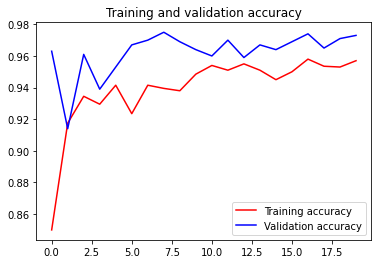

##### Copyright 2019 The TensorFlow Authors.


```
#@title Licensed under the Apache License, Version 2.0 (the "License");
# you may not use this file except in compliance with the License.
# You may obtain a copy of the License at
#
# https://www.apache.org/licenses/LICENSE-2.0
#
# Unless required by applicable law or agreed to in writing, software
# distributed under the License is distributed on an "AS IS" BASIS,
# WITHOUT WARRANTIES OR CONDITIONS OF ANY KIND, either express or implied.
# See the License for the specific language governing permissions and
# limitations under the License.
```

Load InceptionV3 model


```
import os

from tensorflow.keras import layers
from tensorflow.keras import Model
!wget --no-check-certificate \
    https://storage.googleapis.com/mledu-datasets/inception_v3_weights_tf_dim_ordering_tf_kernels_notop.h5 \
    -O /tmp/inception_v3_weights_tf_dim_ordering_tf_kernels_notop.h5
  
from tensorflow.keras.applications.inception_v3 import InceptionV3

local_weights_file = '/tmp/inception_v3_weights_tf_dim_ordering_tf_kernels_notop.h5'

pre_trained_model = InceptionV3(input_shape = (150, 150, 3), 
                                include_top = False, 
                                weights = None)

pre_trained_model.load_weights(local_weights_file)

for layer in pre_trained_model.layers:
  layer.trainable = False
  
# pre_trained_model.summary()

last_layer = pre_trained_model.get_layer('mixed7')
print('last layer output shape: ', last_layer.output_shape)
last_output = last_layer.output
```

    --2021-04-25 13:57:57--  https://storage.googleapis.com/mledu-datasets/inception_v3_weights_tf_dim_ordering_tf_kernels_notop.h5
    Resolving storage.googleapis.com (storage.googleapis.com)... 74.125.20.128, 74.125.142.128, 74.125.195.128, ...
    Connecting to storage.googleapis.com (storage.googleapis.com)|74.125.20.128|:443... connected.
    HTTP request sent, awaiting response... 200 OK
    Length: 87910968 (84M) [application/x-hdf]
    Saving to: ‘/tmp/inception_v3_weights_tf_dim_ordering_tf_kernels_notop.h5’
    
    /tmp/inception_v3_w 100%[===================>]  83.84M  46.1MB/s    in 1.8s    
    
    2021-04-25 13:57:59 (46.1 MB/s) - ‘/tmp/inception_v3_weights_tf_dim_ordering_tf_kernels_notop.h5’ saved [87910968/87910968]
    
    last layer output shape:  (None, 7, 7, 768)


Build and compile the model


```
from tensorflow.keras.optimizers import RMSprop

# Flatten the output layer to 1 dimension
x = layers.Flatten()(last_output)
# Add a fully connected layer with 1,024 hidden units and ReLU activation
x = layers.Dense(1024, activation='relu')(x)
# Add a dropout rate of 0.2
x = layers.Dropout(0.2)(x)                  
# Add a final sigmoid layer for classification
x = layers.Dense  (1, activation='sigmoid')(x)           

model = Model( pre_trained_model.input, x) 

model.compile(optimizer = RMSprop(lr=0.0001), 
              loss = 'binary_crossentropy', 
              metrics = ['accuracy'])

```

Load data


```
!wget --no-check-certificate \
        https://storage.googleapis.com/mledu-datasets/cats_and_dogs_filtered.zip \
       -O /tmp/cats_and_dogs_filtered.zip

from tensorflow.keras.preprocessing.image import ImageDataGenerator

import os
import zipfile

local_zip = '//tmp/cats_and_dogs_filtered.zip'

zip_ref = zipfile.ZipFile(local_zip, 'r')

zip_ref.extractall('/tmp')
zip_ref.close()

# Define our example directories and files
base_dir = '/tmp/cats_and_dogs_filtered'

train_dir = os.path.join( base_dir, 'train')
validation_dir = os.path.join( base_dir, 'validation')


train_cats_dir = os.path.join(train_dir, 'cats') # Directory with our training cat pictures
train_dogs_dir = os.path.join(train_dir, 'dogs') # Directory with our training dog pictures
validation_cats_dir = os.path.join(validation_dir, 'cats') # Directory with our validation cat pictures
validation_dogs_dir = os.path.join(validation_dir, 'dogs')# Directory with our validation dog pictures

train_cat_fnames = os.listdir(train_cats_dir)
train_dog_fnames = os.listdir(train_dogs_dir)

# Add our data-augmentation parameters to ImageDataGenerator
train_datagen = ImageDataGenerator(rescale = 1./255.,
                                   rotation_range = 40,
                                   width_shift_range = 0.2,
                                   height_shift_range = 0.2,
                                   shear_range = 0.2,
                                   zoom_range = 0.2,
                                   horizontal_flip = True)

# Note that the validation data should not be augmented!
test_datagen = ImageDataGenerator( rescale = 1.0/255. )

# Flow training images in batches of 20 using train_datagen generator
train_generator = train_datagen.flow_from_directory(train_dir,
                                                    batch_size = 20,
                                                    class_mode = 'binary', 
                                                    target_size = (150, 150))     

# Flow validation images in batches of 20 using test_datagen generator
validation_generator =  test_datagen.flow_from_directory( validation_dir,
                                                          batch_size  = 20,
                                                          class_mode  = 'binary', 
                                                          target_size = (150, 150))
```

    --2021-04-25 13:58:24--  https://storage.googleapis.com/mledu-datasets/cats_and_dogs_filtered.zip
    Resolving storage.googleapis.com (storage.googleapis.com)... 74.125.142.128, 74.125.195.128, 74.125.20.128, ...
    Connecting to storage.googleapis.com (storage.googleapis.com)|74.125.142.128|:443... connected.
    HTTP request sent, awaiting response... 200 OK
    Length: 68606236 (65M) [application/zip]
    Saving to: ‘/tmp/cats_and_dogs_filtered.zip’
    
    /tmp/cats_and_dogs_ 100%[===================>]  65.43M  73.4MB/s    in 0.9s    
    
    2021-04-25 13:58:25 (73.4 MB/s) - ‘/tmp/cats_and_dogs_filtered.zip’ saved [68606236/68606236]
    
    Found 2000 images belonging to 2 classes.
    Found 1000 images belonging to 2 classes.


Train the model


```
history = model.fit(
            train_generator,
            validation_data = validation_generator,
            steps_per_epoch = 100,
            epochs = 20,
            validation_steps = 50,
            verbose = 2)
```

    Epoch 1/20
    100/100 - 53s - loss: 0.3438 - accuracy: 0.8500 - val_loss: 0.1122 - val_accuracy: 0.9630
    Epoch 2/20
    100/100 - 17s - loss: 0.2088 - accuracy: 0.9175 - val_loss: 0.2703 - val_accuracy: 0.9140
    Epoch 3/20
    100/100 - 17s - loss: 0.1933 - accuracy: 0.9345 - val_loss: 0.1055 - val_accuracy: 0.9610
    Epoch 4/20
    100/100 - 17s - loss: 0.2030 - accuracy: 0.9295 - val_loss: 0.1869 - val_accuracy: 0.9390
    Epoch 5/20
    100/100 - 17s - loss: 0.1797 - accuracy: 0.9415 - val_loss: 0.1431 - val_accuracy: 0.9530
    Epoch 6/20
    100/100 - 17s - loss: 0.2038 - accuracy: 0.9235 - val_loss: 0.0977 - val_accuracy: 0.9670
    Epoch 7/20
    100/100 - 17s - loss: 0.1540 - accuracy: 0.9415 - val_loss: 0.0934 - val_accuracy: 0.9700
    Epoch 8/20
    100/100 - 17s - loss: 0.1676 - accuracy: 0.9395 - val_loss: 0.0995 - val_accuracy: 0.9750
    Epoch 9/20
    100/100 - 17s - loss: 0.1823 - accuracy: 0.9380 - val_loss: 0.1089 - val_accuracy: 0.9690
    Epoch 10/20
    100/100 - 17s - loss: 0.1552 - accuracy: 0.9485 - val_loss: 0.1215 - val_accuracy: 0.9640
    Epoch 11/20
    100/100 - 17s - loss: 0.1565 - accuracy: 0.9540 - val_loss: 0.1292 - val_accuracy: 0.9600
    Epoch 12/20
    100/100 - 17s - loss: 0.1409 - accuracy: 0.9510 - val_loss: 0.1112 - val_accuracy: 0.9700
    Epoch 13/20
    100/100 - 17s - loss: 0.1359 - accuracy: 0.9550 - val_loss: 0.1306 - val_accuracy: 0.9590
    Epoch 14/20
    100/100 - 17s - loss: 0.1497 - accuracy: 0.9510 - val_loss: 0.1156 - val_accuracy: 0.9670
    Epoch 15/20
    100/100 - 17s - loss: 0.1664 - accuracy: 0.9450 - val_loss: 0.1067 - val_accuracy: 0.9640
    Epoch 16/20
    100/100 - 17s - loss: 0.1329 - accuracy: 0.9500 - val_loss: 0.1094 - val_accuracy: 0.9690
    Epoch 17/20
    100/100 - 17s - loss: 0.1152 - accuracy: 0.9580 - val_loss: 0.1074 - val_accuracy: 0.9740
    Epoch 18/20
    100/100 - 17s - loss: 0.1367 - accuracy: 0.9535 - val_loss: 0.1300 - val_accuracy: 0.9650
    Epoch 19/20
    100/100 - 17s - loss: 0.1440 - accuracy: 0.9530 - val_loss: 0.1080 - val_accuracy: 0.9710
    Epoch 20/20
    100/100 - 17s - loss: 0.1189 - accuracy: 0.9570 - val_loss: 0.1202 - val_accuracy: 0.9730


Plot accuracy at each iteration


```
import matplotlib.pyplot as plt
acc = history.history['accuracy']
val_acc = history.history['val_accuracy']
loss = history.history['loss']
val_loss = history.history['val_loss']

epochs = range(len(acc))

plt.plot(epochs, acc, 'r', label='Training accuracy')
plt.plot(epochs, val_acc, 'b', label='Validation accuracy')
plt.title('Training and validation accuracy')
plt.legend(loc=0)
plt.figure()


plt.show()
```





    <Figure size 432x288 with 0 Axes>


With transfer learning we are able to reach 95% accuracy, while without the augmentation the maximal accuracy was around 85%


```

```
