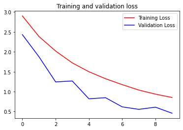

# Sign language MNIST classification using CNN and data augmentation


```python
#@title Licensed under the Apache License, Version 2.0 (the "License");
# you may not use this file except in compliance with the License.
# You may obtain a copy of the License at
#
# https://www.apache.org/licenses/LICENSE-2.0
#
# Unless required by applicable law or agreed to in writing, software
# distributed under the License is distributed on an "AS IS" BASIS,
# WITHOUT WARRANTIES OR CONDITIONS OF ANY KIND, either express or implied.
# See the License for the specific language governing permissions and
# limitations under the License.
```

## Get data


```python
import csv
import numpy as np
import tensorflow as tf
from tensorflow.keras.preprocessing.image import ImageDataGenerator
from google.colab import files
```

The data for this exercise is available at: https://www.kaggle.com/datamunge/sign-language-mnist/home

Sign up and download to find 2 CSV files: sign_mnist_test.csv and sign_mnist_train.csv -- You will upload both of them using this button before you can continue.


```python
uploaded=files.upload()
```


<input type="file" id="files-b824c2df-c6d1-46f7-b5aa-ddc7c79d8e58" name="files[]" multiple disabled
   style="border:none" />
<output id="result-b824c2df-c6d1-46f7-b5aa-ddc7c79d8e58">
 Upload widget is only available when the cell has been executed in the
 current browser session. Please rerun this cell to enable.
 </output>
 <script src="/nbextensions/google.colab/files.js"></script> 


    Saving sign_mnist_test.csv to sign_mnist_test.csv
    Saving sign_mnist_train.csv to sign_mnist_train.csv


```python
def get_data(filename):
  # You will need to write code that will read the file passed
  # into this function. The first line contains the column headers
  # so you should ignore it
  # Each successive line contians 785 comma separated values between 0 and 255
  # The first value is the label
  # The rest are the pixel values for that picture
  # The function will return 2 np.array types. One with all the labels
  # One with all the images
  #
  # Tips: 
  # If you read a full line (as 'row') then row[0] has the label
  # and row[1:785] has the 784 pixel values
  # Take a look at np.array_split to turn the 784 pixels into 28x28
  # You are reading in strings, but need the values to be floats
  # Check out np.array().astype for a conversion
    with open(filename) as training_file:
      # Your code starts here
      # read the data
        data = csv.reader(training_file, delimiter = ',')
        #
        #skip the header
        next(data)
        #
        #initialise lists of images and labels
        images = []
        labels = []
        #
        # read out images and labels from rows
        for row in data:
            label = row[0]
            image = np.array(row[1:]).reshape((28,28))
            labels.append(label)
            images.append(image)
        #
        # convert them to arrays and floats
        images=np.array(images).astype(float)
        labels=np.array(labels).astype(float)
      # Your code ends here
    return images, labels


training_images, training_labels = get_data('sign_mnist_train.csv')
testing_images, testing_labels = get_data('sign_mnist_test.csv')

# Keep these
print(training_images.shape)
print(training_labels.shape)
print(testing_images.shape)
print(testing_labels.shape)

# Their output should be:
# (27455, 28, 28)
# (27455,)
# (7172, 28, 28)
# (7172,)
```

    (27455, 28, 28)
    (27455,)
    (7172, 28, 28)
    (7172,)


```python
# In this section you will have to add another dimension to the data
# So, for example, if your array is (10000, 28, 28)
# You will need to make it (10000, 28, 28, 1)
# Hint: np.expand_dims

training_images = np.expand_dims(training_images, axis=3)
testing_images = np.expand_dims(testing_images, axis=3)

# Create an ImageDataGenerator and do Image Augmentation
train_datagen = ImageDataGenerator(
    rescale = 1./255,
    rotation_range=40,
    width_shift_range=0.2,
    height_shift_range=0.2,
    shear_range=0.2,
    zoom_range=0.2,
    horizontal_flip=True,
    fill_mode='nearest'
    )

validation_datagen = ImageDataGenerator(rescale = 1./255)
    # Your Code Here)
    
# Keep These
print(training_images.shape)
print(testing_images.shape)
    
# Their output should be:
# (27455, 28, 28, 1)
# (7172, 28, 28, 1)
```

    (27455, 28, 28, 1)
    (7172, 28, 28, 1)


## Build a CNN model and train it


```python
# Define the model
# Use no more than 2 Conv2D and 2 MaxPooling2D
model = tf.keras.models.Sequential([
    tf.keras.layers.Conv2D(32, (3,3), activation='relu', input_shape=(28, 28, 1)),
    tf.keras.layers.MaxPooling2D(2, 2),
    # The second convolution
    tf.keras.layers.Conv2D(32, (3,3), activation='relu'),
    tf.keras.layers.MaxPooling2D(2,2),
    # Flatten the results to feed into a DNN
    tf.keras.layers.Flatten(),
    #tf.keras.layers.Dropout(0.5),
    # 512 neuron hidden layer
    tf.keras.layers.Dense(512, activation='relu'),
    # use 26 ouputs to map 26 letters of the English alphabet
    tf.keras.layers.Dense(26, activation='softmax')
])

# Compile Model. 
model.compile(loss = 'sparse_categorical_crossentropy', 
              optimizer='rmsprop', 
              metrics=['accuracy'])

# data generators
train_generator = train_datagen.flow(training_images,
                                     training_labels,
                                     batch_size=100)

validation_generator = validation_datagen.flow(testing_images,
                                     testing_labels,
                                     batch_size=100)

# Train the Model
history = model.fit_generator(train_generator, 
                              epochs=10, 
                              validation_data = validation_generator)

model.evaluate(testing_images, testing_labels)
    
# The output from model.evaluate should be close to:
[6.92426086682151, 0.56609035]

```

    Epoch 1/10
    275/275 [==============================] - 23s 84ms/step - loss: 2.9041 - accuracy: 0.1370 - val_loss: 2.4333 - val_accuracy: 0.1751
    Epoch 2/10
    275/275 [==============================] - 23s 83ms/step - loss: 2.3856 - accuracy: 0.2742 - val_loss: 1.8768 - val_accuracy: 0.4173
    Epoch 3/10
    275/275 [==============================] - 23s 83ms/step - loss: 2.0212 - accuracy: 0.3694 - val_loss: 1.2444 - val_accuracy: 0.5824
    Epoch 4/10
    275/275 [==============================] - 23s 83ms/step - loss: 1.7235 - accuracy: 0.4567 - val_loss: 1.2682 - val_accuracy: 0.5407
    Epoch 5/10
    275/275 [==============================] - 23s 83ms/step - loss: 1.5007 - accuracy: 0.5214 - val_loss: 0.8203 - val_accuracy: 0.6842
    Epoch 6/10
    275/275 [==============================] - 23s 83ms/step - loss: 1.3254 - accuracy: 0.5706 - val_loss: 0.8477 - val_accuracy: 0.7108
    Epoch 7/10
    275/275 [==============================] - 23s 83ms/step - loss: 1.1773 - accuracy: 0.6181 - val_loss: 0.6176 - val_accuracy: 0.8067
    Epoch 8/10
    275/275 [==============================] - 23s 83ms/step - loss: 1.0403 - accuracy: 0.6613 - val_loss: 0.5549 - val_accuracy: 0.8055
    Epoch 9/10
    275/275 [==============================] - 23s 83ms/step - loss: 0.9377 - accuracy: 0.6945 - val_loss: 0.6099 - val_accuracy: 0.7909
    Epoch 10/10
    275/275 [==============================] - 23s 83ms/step - loss: 0.8529 - accuracy: 0.7204 - val_loss: 0.4574 - val_accuracy: 0.8314
    225/225 [==============================] - 2s 7ms/step - loss: 153.8652 - accuracy: 0.6157


    [6.92426086682151, 0.56609035]


## Plot the accuracy of the training


```python
# Plot the chart for accuracy and loss on both training and validation

import matplotlib.pyplot as plt
acc = history.history['accuracy']
val_acc = history.history['val_accuracy']
loss = history.history['loss']
val_loss = history.history['val_loss']

epochs = range(len(acc))

plt.plot(epochs, acc, 'r', label='Training accuracy')
plt.plot(epochs, val_acc, 'b', label='Validation accuracy')
plt.title('Training and validation accuracy')
plt.legend()
plt.figure()

plt.plot(epochs, loss, 'r', label='Training Loss')
plt.plot(epochs, val_loss, 'b', label='Validation Loss')
plt.title('Training and validation loss')
plt.legend()

plt.show()
```




